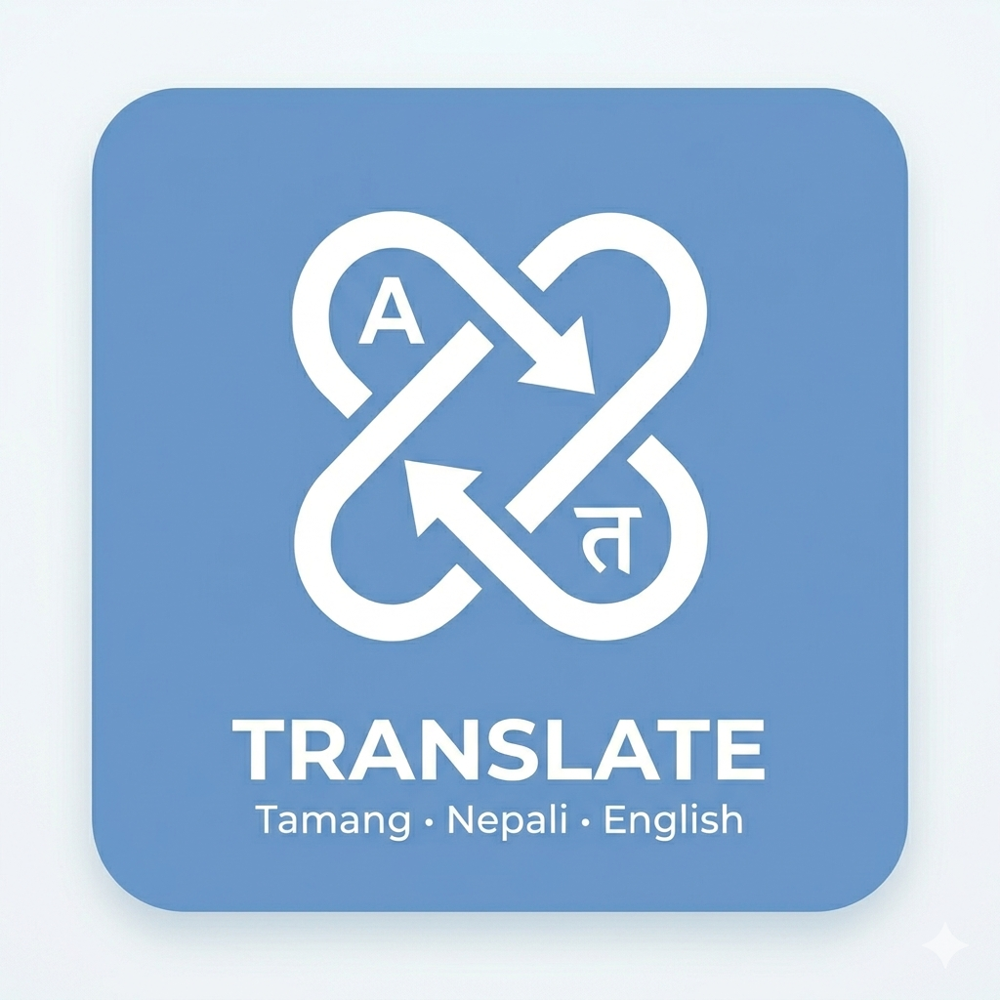

<div align="center">
  
  <h1>TMT Translate Extension</h1>
  <p>Tamang • Nepali • English — browser extension for fast, sentence-level translation.</p>
</div>

---

## Overview

TMT Translate is a Chrome/Firefox extension that provides:
- **Selection translation** via right‑click context menu with a tooltip result
- **Full‑page translation** (sentence‑by‑sentence with rate limiting)
- **Popup UI** for language selection and settings

The extension uses the official TMT Translation API and stores your API token locally.

---

## Features

- Context‑menu translation for selected text
- Tooltip UI with adjustable **size** and **width**
- Full‑page translation with **sentence‑by‑sentence replacement**
- **Rate limited** to 60 requests/minute with automatic backoff
- Progress and ETA display in the popup
- Restore original page after translation

---

## Quick Start

### Prerequisites
- **Node.js 18.18.2** (see `.nvmrc`)
- **Yarn 1.x**

### Install dependencies
```bash
yarn
```

### Run in development
```bash
yarn dev:chrome
# or
yarn dev:firefox
```

### Production builds
```bash
yarn build:chrome
# or
yarn build:firefox
```

---

## Load the extension

### Chrome
1. Visit `chrome://extensions`
2. Enable **Developer mode**
3. Click **Load unpacked**
4. Select `dist_chrome`

### Firefox
1. Visit `about:debugging#/runtime/this-firefox`
2. Click **Load Temporary Add-on**
3. Select `dist_firefox/manifest.json`

---

## Usage

### 1) Add API Key
- Open the popup → **Settings**
- Paste your team token (e.g., `team_xxxxxxxxxxxxxxxx`)
- Click **Save Settings**

### 2) Translate selection
- Highlight any text
- Right‑click → **Translate selection**
- Tooltip appears with translation

### 3) Translate full page
- Open popup → **Full Page**
- Click **Translate This Page**
- Watch progress + ETA
- Click **Restore Original Page** to undo

---

## Project Structure

```
src/
  pages/
    background/   # Background service worker (API + orchestration)
    content/      # Content script (tooltips + page translation)
    popup/        # UI (Translate + Settings)
  assets/
public/           # Icons and public assets
manifest.json     # Manifest V3 base
vite.config.*     # Chrome/Firefox build configs
```

---

## Core Components

### `src/pages/background/index.ts`
- Handles API requests
- Context‑menu integration
- Sends translation results to content scripts
- Page‑translation orchestration

### `src/pages/content/index.tsx`
- Tooltip rendering and styling
- Full‑page translation with sentence splitting
- Rate‑limit handling (60/min)
- Restore original text

### `src/pages/popup/Popup.tsx`
- Language selection
- Tooltip size/width settings
- Page translation controls
- Progress + ETA display

---

## Rate Limiting

The API limits to **60 calls per minute**.  
The extension:
- throttles requests (1 per 1.2 seconds)
- pauses for **60 seconds** on 429 responses
- resumes automatically

---

## Deployment

This repository includes GitHub Actions CI:

- Builds **Chrome** and **Firefox** packages on push/PR
- Artifacts are uploaded from `dist_chrome` and `dist_firefox`

To ship:
1. Run `yarn build:chrome` / `yarn build:firefox`
2. Zip the build output
3. Upload to Chrome Web Store / Mozilla AMO

---

## Scripts

```bash
yarn dev:chrome
yarn dev:firefox
yarn build:chrome
yarn build:firefox
```

---

## Notes

- Your API key is stored **locally** via `storage.local`
- Do not commit your API key to version control
- Some sites dynamically change DOM; translation may be partial on highly dynamic pages

---

## License

MIT
